# ShirohaChat 项目文档

## 摘要

在人类沟通长期依赖书信等传统方式的阶段,信息传递的延迟与成本长期存在:跨地域沟通困难、往返周期长,在“等待回信”的过程中,关键信息往往滞后甚至错过最佳时点。手机普及与移动互联网兴起后,人们对“随时联系、即时回应”的需求迅速成为日常生活的刚需,即时通讯由此从工具性产品演进为社会连接的基础设施,以更低成本、更高频率支撑人与人之间更及时、更亲密的沟通。

在这一背景下,本项目拟开发一款面向大众的普适即时通讯工具——ShirohaChat(桌面端)。产品聚焦日常沟通场景,服务朋友、家人、异地恋与同学等社交关系维护需求,围绕“及时触达、顺畅表达、稳定可靠、隐私可控”四个方向构建核心体验,覆盖私聊/群聊、文本/图片/语音/表情与文件发送、离线消息与重连、已读未读与消息搜索等基础能力,满足大众用户对即时联系与低成本连接的长期需求。

在开发过程中,团队基于面向对象分析与设计方法(OOAD)和统一建模语言(UML)进行系统建模,采用客户端-服务器架构(C/S)实现消息实时传递。项目引入**非功能性需求(NFR)**管理、**协议契约设计**、**风险管理矩阵**与**量化性能指标**。系统实现端到端延迟 ≤ 200ms、消息送达率 ≥ 99.99%、单节点支持 ≥ 5000 并发连接,具备断线重连与离线补发机制,确保消息零丢失。

关键词:大众即时通讯,社交沟通,私聊,群聊,离线消息,消息可靠性,低延迟,NFR

---

## 修改历史

| 日期 | 版本 | 修改说明 | 作者 |
| --- | --- | ------- | --- |
|     |     |         |     |

---

## 目录

* 摘要
* 第1章 立项

  * 1.1 项目起源与提案
  * 1.2 Business Case
* 第2章 愿景

  * 2.1 问题陈述
  * 2.2 涉众与用户
  * 2.3 关键涉众和用户的需要
  * 2.4 产品概述
  * 2.5 产品特性
  * 2.6 其他产品需求
* 第3章 用况建模

  * 3.1 术语表
  * 3.2 主要用况
  * 3.3 用况的完整描述
* 第4章 需求分析
* 第5章 架构设计
* 第6章 详细设计
* 后记
* 参考文献

---

# 第1章 立项

## 1.1 项目起源与提案

### 项目背景

在书信等传统沟通方式主导的年代,信息传递延迟高、成本高,跨地域沟通尤为困难,人与人之间的联系往往被时间与距离切割。手机普及后,人们对“随时联系、即时回应”的需求迅速增长,即时通讯成为日常生活的基础设施:它不仅承担信息传递,也承载关系维护、情感表达与社交连接。

在大众沟通场景中,用户对即时通讯的核心期待并不复杂,但要求极高:要快、要稳、要省心、要可信。若基础体验存在短板,会直接放大沟通成本与情绪摩擦,主要体现在三类问题:

**1. 聊天入口多，重要信息难定位**
* 私聊与群聊同时进行,对话入口繁杂
* 约定时间、地址、转账说明等关键信息容易被刷屏淹没
* 回看成本高,错过信息后需要二次确认

**2. 表达与互动能力需要完整覆盖**
大众沟通不仅是“发文字”,还包括语音、图片、表情与文件等多模态表达,并需要引用、转发、撤回等高频互动能力,以降低误解与重复沟通。

**3. 弱网与离线场景下的可靠性与隐私诉求突出**
在网络波动、断线重连、设备切换等场景下,用户更关注“消息是否到达、是否重复、是否丢失”;同时,对隐私设置、黑名单与骚扰拦截也有明确预期。

### 项目定位

> **"一款面向大众的普适桌面端即时通讯工具,聚焦朋友与家人等日常社交关系维护,以低延迟、高可靠与隐私可控为基础,提供私聊/群聊与多媒体表达能力,满足随时联系、即时回应的沟通刚需。"**

### 核心价值主张

* **更及时**:降低“联系到对方”的等待成本,让沟通回到即时与自然的节奏
* **更亲密**:以语音、图片、表情等表达方式承载情绪与关系温度
* **更低成本**:让跨地域沟通与群体沟通不再受制于时间与费用
* **更可靠**:在弱网与断线情况下保持一致体验,尽量减少丢失与重复

## 1.2 Business Case

### 项目目标

开发一款**高性能、高可用**的普适即时通讯系统,采用MoSCoW方法进行功能优先级管理:

#### Must Have (MVP核心)
1. 账号体系(手机号/邮箱注册登录)
2. 联系人体系(添加/删除/备注/黑名单)
3. 私聊/群聊
4. 文本/图片/语音/表情消息
5. 文件发送(小文件)
6. Server-ACK机制
7. 离线消息拉取
8. 桌面客户端

#### Should Have
1. 搜索(按关键词/联系人/群组)
2. 已读/未读与未读计数
3. 置顶会话与消息引用回复
4. 消息撤回与转发

#### Could Have
1. 消息收藏
2. 群公告与群管理(入群方式、禁言、管理员)
3. 断网/弱网重连动画
4. 陌生人消息请求与反骚扰策略(开关、频控、举报)

#### Won't Have (本轮不做)
1. 视频/语音通话
2. 多端同步
3. 实时协作文档

### 预期收益

* **用户价值(大众用户)**:随时联系、即时回应,跨地域沟通成本显著降低,社交关系维护更自然、更稳定
* **用户价值(群体关系)**:群聊信息更清晰,重要信息更不易错过,降低重复确认与误解成本
* **技术价值**:提供零丢失、低延迟(≤200ms)、稳定可靠的实时通讯服务
* **学习价值**:完整展示IM系统的工业级架构设计,包含NFR管理、协议设计、可靠性机制与性能压测方法

### 约束与假设

| 维度   | 约束条件                              |
| ---- | --------------------------------- |
| 时间   | 一学期开发周期,分三个迭代里程碑交付              |
| 技术   | 编程语言限 C++20 + QML(Qt 6.5+),不使用第三方 IM SDK |
| 平台   | 仅桌面端(Linux/Windows/macOS),暂不考虑移动端 |
| 协议   | 基于 WebSocket 的自定义 JSON 协议,不使用 XMPP/MQTT 等现成协议 |
| 存储   | 客户端与服务端均使用 SQLite 嵌入式数据库,不引入外部数据库服务 |
| 团队   | 小型开发团队(1-3人),角色兼任前后端与测试           |
| 安全   | 服务端使用 JWT 令牌认证,密钥通过环境变量管理;首版不做端到端加密 |


### 非功能性需求 (NFR)

| 维度   | 指标要求            | 验证方法              |
| ---- | --------------- | ----------------- |
| 延迟   | 端到端消息投递延迟 ≤ 200ms(同机房) | WebSocket 抓包计时 + 日志时间戳差值统计 |
| 可靠性  | 消息送达率 ≥ 99.99%,离线消息零丢失 | ACK 机制 + 离线队列端到端验证,构造断网场景验证补发 |
| 并发   | 单服务端节点支持 ≥ 5000 同时在线连接 | 使用 WebSocket 压测工具模拟并发连接 |
| 安全   | JWT 令牌认证,HMAC-SHA256 签名,令牌有效期可配置 | 伪造/过期 Token 拒绝测试 |
| 可用性  | 断线后 3 秒内自动重连,重连期间 UI 明确提示连接状态 | 手动断网/恢复测试,观察 ConnectionStatusBar |
| 吞吐   | 消息内容上限 4096 字符;群成员上限受服务端配置约束 | 边界值发送测试 |
| 存储   | 客户端消息/会话/联系人本地 SQLite 持久化,支持历史翻阅 | 清理缓存后重启,验证数据完整性 |


---

# 第2章 愿景

## 2.1 问题陈述

### 问题一：即时联系成为刚需,基础体验要求更高

| 要素   | 描述                                                                  |
| ---- | ------------------------------------------------------------------- |
| 问题   | 手机普及后,“随时联系、即时回应”成为大众沟通的基本预期,但在弱网、断线、设备切换与高频群聊等场景下,消息到达与阅读状态不确定、重要信息易错过、回看与检索成本高等问题依然普遍存在。 |
| 影响群体 | 大众用户(朋友、家人、异地恋、同学等社交关系)、需要跨地域保持联系的人群。                                   |
| 后果   | 错过关键信息、反复确认造成沟通疲劳,并在高频互动中引发误解与情绪摩擦,抬高关系维护成本。          |
| 解决方案 | ShirohaChat 聚焦“及时触达与稳定可靠”:提供 Server-ACK、离线补发与断线重连,并配套清晰的未读计数、搜索与隐私/反骚扰设置,让沟通更省心。 |

### 问题二：现有方案的技术局限

| 要素   | 描述                                                 |
| ---- | -------------------------------------------------- |
| 问题   | 主流闭源 IM 系统难以进行架构研究与二次开发，开源方案多为 Demo 级别，缺乏工业级设计。 |
| 影响群体 | 软件工程学习者、系统架构研究者。                                   |
| 后果   | 理论与实践脱节，无法深入理解 WebSocket、消息可靠性、分布式状态管理等核心技术。    |
| 解决方案 | ShirohaChat 开源完整架构设计（含 NFR、协议、风险管理），可作为学习与扩展基础。   |

---

## 2.2 涉众与用户

### 1. 涉众分析

| 涉众类型  | 代表       | 核心诉求                           | 优先级  |
| ----- | -------- | ------------------------------ | ---- |
| 项目团队  | 开发组/测试组  | 掌握工业级 IM 架构设计与实现能力              | 高    |
| 目标用户  | 大众用户     | 稳定、易用的日常即时通讯工具                 | 高    |
| 技术评审者 | 导师/面试官   | 系统展示专业性（架构、性能、文档）              | 高    |
| 潜在扩展者 | 开源社区开发者  | 清晰的代码结构与接口文档                   | 中    |

### 2. 用户画像(典型大众场景)

#### 小周 - 异地恋用户

* **场景**:日常高频私聊,需要在不同时间与地点保持“随时联系、即时回应”
* **痛点**:
  - 弱网或断线时消息状态不明确,容易产生“是否收到”的焦虑
  - 夜间或工作时段需要更细粒度的通知与免打扰控制
  - 希望表达更自然(语音、图片、表情),但不希望操作复杂
* **期望**:消息到达更确定、通知可控、表达顺畅且操作简单

#### 阿慧 - 家庭群组织者

* **场景**:家庭群日常沟通与信息转达(聚餐时间、出行信息、照片分享等)
* **痛点**:
  - 群聊刷屏后重要信息容易被淹没,成员反复询问
  - 老人不熟悉复杂操作,需要更直观的未读与提示
  - 图片与文件较多时,回看与查找成本高
* **期望**:群聊信息更清晰、老人也能轻松使用、历史内容更好找

#### 小林 - 与陌生人沟通的用户

* **场景**:二手交易、兴趣社交等场景下与陌生人短期沟通
* **痛点**:
  - 易收到骚扰信息,需要明确的消息请求与拦截机制
  - 希望能快速建立联系,同时保护隐私
  - 沟通结束后希望一键清理并控制对方可见范围
* **期望**:更强的反骚扰与隐私设置、陌生人沟通更安全可控

---

## 2.3 关键涉众和用户的需要

| 涉众/用户 | 核心需求                            | 系统响应                        |
| ----- | ------------------------------- | --------------------------- |
| 大众用户  | 低延迟、消息可靠到达、离线补发、通知可控、隐私与反骚扰      | Server-ACK + 离线补发 + 未读计数/搜索 + 黑名单/消息请求  |
| 开发者   | 模块化架构、清晰接口文档、易于扩展               | API文档 + 分层设计 + 代码规范  |
| 评审者   | 展示系统专业性（性能指标、架构图、风险管理）          | NFR 量化 + 压测报告 + UML建模     |
| 运维者   | 一键部署、监控日志、故障恢复                  | 容器化部署 + 日志系统      |

---

## 2.4 产品概述

### 1. 产品定位陈述 (Elevator Pitch)

> **For** 大众用户(朋友、家人、异地恋、同学与陌生人沟通场景)  
> **Who** 在跨地域与高频社交沟通中需要“随时联系、即时回应”,并希望消息更可靠、通知更可控、隐私更安心  
> **The** ShirohaChat  
> **Is a** 面向大众的桌面端即时通讯工具  
> **That** 提供私聊/群聊、多媒体消息、未读与搜索、黑名单与消息请求等能力,并以 Server-ACK 与离线补发保证消息可靠送达  
> **Unlike** 微信(功能堆叠、入口复杂)、QQ(界面复杂、广告干扰)、Discord(国内访问难)  
> **Our product** 以“简洁、可靠、可控”为优先,同时保证消息可靠性≥99.99%、端到端延迟≤200ms,提供更聚焦的桌面端沟通体验

### 2. 完整的产品概述

ShirohaChat 是一款**面向大众的即时通讯系统(桌面端)**,采用前后端分离的 C/S 架构:

* **前端**:桌面客户端,提供联系人与会话列表,支持文本/图片/语音/表情与文件消息展示,并提供搜索与未读管理
* **后端**:实时通讯服务,实现Server-ACK、离线消息队列、在线状态与重连机制
* **数据层**:持久化存储用户/群组/消息数据,缓存在线状态与离线消息队列
* **核心特性**:
  - **日常沟通**:私聊/群聊、多媒体消息、引用回复与转发
  - **信息管理**:未读计数、消息搜索、置顶会话与收藏
  - **隐私与安全**:黑名单、陌生人消息请求、基础反骚扰策略
  - **消息可靠性**:Server-ACK机制、离线补发、消息零丢失(≥99.99%)
  - **高性能**:端到端延迟≤200ms,单节点支持≥5000并发连接

---

## 2.5 产品特性

| 优先级      | 功能模块             | 具体特性                             | 技术实现                    |
| -------- | ---------------- | -------------------------------- | ----------------------- |
| Must Have | 账号与认证        | 账号注册/登录,JWT 令牌自动续期,缓存 Token 免重复登录 | AuthController + AuthenticateUseCase + JwtManager |
| Must Have | 私聊             | 一对一文本消息发送与接收,消息状态追踪(发送中/已送达/失败) | ChatViewModel + SendMessageUseCase + ReceiveMessageUseCase |
| Must Have | 群聊             | 创建群组、添加/移除成员、退群,群消息广播 | GroupController + GroupManagementUseCase + GroupHandler |
| Must Have | 联系人管理        | 发送/接受/拒绝好友请求,好友列表展示 | ContactController + FriendRequestUseCase + FriendHandler |
| Must Have | 消息可靠性        | Server-ACK 确认、发送超时重试、离线消息队列补发 | MessageDeliveryService + OfflineManager + ACK Timer |
| Must Have | 会话管理          | 会话列表排序(按最新消息时间)、会话切换、未读计数 | SessionListController + SwitchSessionUseCase + SessionSyncUseCase |
| Should Have | 连接状态反馈     | 实时展示 WebSocket 连接状态(连接中/已连接/断开) | ConnectionStatusBar + NetworkService 信号 |
| Should Have | 断线自动重连      | 网络恢复后自动重建 WebSocket 连接并恢复会话 | NetworkService 重连逻辑 |
| Should Have | 消息重发          | 发送失败的消息支持一键手动重发 | ChatViewModel.resendMessage() + SendMessageUseCase.resendMessage() |
| Could Have | 心跳保活          | 客户端定时发送心跳包,服务端清理超时连接 | HeartbeatHandler + SessionManager.sweepTimeouts() |

---

## 2.6 其他产品需求

### 安全性需求

* **身份认证**:服务端采用 JWT(HMAC-SHA256)无状态令牌认证,客户端在连接时自动携带缓存 Token,过期后由服务端签发新令牌。
* **输入校验**:客户端对消息内容进行非空与长度校验(≤4096 字符);服务端对所有入站参数进行二次校验,防止恶意构造数据。
* **密钥管理**:JWT 签名密钥通过环境变量(`SHIROHACHAT_JWT_SECRET`)注入,不硬编码在源码中;开发模式下可生成临时随机密钥。

### 兼容性需求

* **跨平台**:客户端基于 Qt 6.5+,可在 Linux、Windows、macOS 上编译运行,不依赖平台特有 API。
* **协议版本控制**:数据包包含 `protocolVersion` 字段,服务端在连接握手时校验协议版本兼容性,拒绝过旧客户端。

### 可维护性需求

* **分层架构**:严格遵循四层分离(表现层/应用逻辑层/领域层/数据管理层),模块间通过接口解耦。
* **编码规范**:使用 C++20 标准,遵循项目命名规范(大驼峰类名、`m_` 前缀成员变量、小驼峰方法名),使用 Doxygen 注释。
* **自动化构建**:CMake 管理构建配置,支持 GTest/QTest 单元测试。
---

# 第3章 用况建模

## 3.1 术语表

| 术语 | 描述 |
| --- | --- |
| 用户（User） | 使用聊天系统的注册使用者 |
| 好友（Friend） | 与用户建立双向连接关系的其他用户 |
| 群聊（Group Chat） | 由多个用户组成的消息会话 |
| 消息（Message） | 文本、图片、文件或表情形式的数据 |
| Emoji | 图形表情符号，用于丰富聊天内容 |

---

## 3.2 ShirohaChat 的主要用况

> **建模原则**: 用况描述的是用户的**业务目标**,而不是系统内部的功能分解。每个用况回答的是"用户想要达成什么",而非"系统内部如何拆分"。

### 用况图

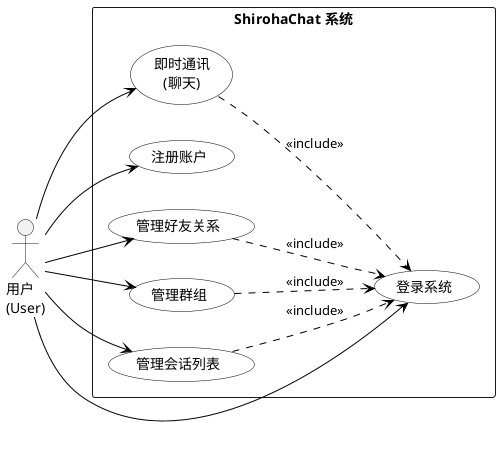

### 用况简要描述

| 编号 | 用况名称 | 简要描述 | 参与者 |
|------|---------|---------|--------|
| UC-01 | 即时通讯（聊天） | 用户选择一个已有的会话（私聊或群聊）,在其中发送文本消息并实时接收对方的回复,从而实现与好友或群组成员的即时沟通。这是系统最核心的用况,所有其他功能最终都服务于这一沟通目的。 | 已登录用户 |
| UC-02 | 注册账户 | 首次使用系统的访客,通过填写个人信息（账号、密码、昵称）创建新账户,从而获得使用系统的身份凭证。 | 匿名访客 |
| UC-03 | 登录系统 | 已注册用户通过验证身份信息进入系统,系统初始化用户数据并建立实时通讯连接,用户由此进入可使用的主界面。 | 已注册用户 |
| UC-04 | 管理好友关系 | 用户为了建立和维护个人的社交网络,通过系统发送添加好友的申请,并能对收到的好友申请做出同意或拒绝的回应,从而建立与其他用户之间的点对点联系。建立好友关系后,双方可以直接发起私聊。 | 已登录用户 |
| UC-05 | 管理群组 | 用户为了与多人进行集体交流,可以创建群组并邀请好友加入,也可以退出不再需要的群组。群主还可以移除不当成员。群组建立后即可开展群聊。 | 已登录用户（群主/群成员） |
| UC-06 | 管理会话列表 | 用户为了快速定位和切换不同的沟通上下文,浏览按最近活跃时间排列的会话列表,查看每个会话的未读消息数与最新消息摘要,并在不同的私聊和群聊之间自由切换。 | 已登录用户 |

---

## 3.3 主要用况的描述

### 3.3.1 即时通讯（聊天）

- **简要描述**：该用况描述用户选择会话、发送文本消息、查看实时反馈以及接收对方消息的完整交互过程。
- **用况图**：待补充。

**前置条件**

1. 用户已登录系统。
2. 用户的网络连接状态正常。
3. 用户的联系人列表中至少存在一个好友或群组。

**基本流（Basic Flow）**

{进入会话}  
1. 用户在主界面的会话列表中，选择一个联系人或群组进行点击。  
2. 系统打开该会话的聊天窗口，并显示之前的历史聊天记录。  

{编辑与发送}  
3. 用户在输入框中输入文本消息。  
4. 用户点击“发送”按钮（或按下回车键）。  
5. 系统对消息内容进行基本验证（如内容不为空）。  
6. 系统在聊天窗口中立即显示该条消息，并由系统显示“发送中”的状态标识。  
7. 系统在确认消息送达后，将消息状态更新为“已送达”标识。  

{接收消息}  
8. 系统在聊天窗口中实时显示对方发来的新消息。  
9. 系统自动滚动聊天视图以展示最新内容。  

**备选流 (Alternative Flows)**

- A1：收到来自其他会话的消息  
  1. 系统在左侧会话列表中，将新消息来源的会话置顶。  
  2. 系统在该会话项上显示未读消息提示（如红点或数字）。  
  3. 用户继续在当前窗口操作，不受干扰。  

- A2：查看历史消息  
  1. 用户向上滚动聊天窗口。  
  2. 系统加载并显示更早之前的聊天记录。  
  3. 用户停止滚动，用况恢复到当前步骤。  

**异常流 (Exception Flows)**

- E1：发送空消息  
  1. 系统检测到内容无效。  
  2. 系统保持发送按钮不可点击，或弹出提示“无法发送空内容”。  
  3. 用况回到基本流步骤 3。  

- E2：发送失败（网络异常）  
  1. 系统在超时或检测到断开后，将该消息的状态标识更新为“发送失败”（如红色感叹号）。  
  2. 用户点击该“失败标识”。  
  3. 系统尝试重新发送。  
     - E2a 重发成功：用况回到基本流步骤 7。  
     - E2b 重发失败：系统再次显示“失败标识”，等待用户下一次操作。  

**后置条件 (Post-conditions)**

- 成功：消息内容被系统存储，且界面显示“已送达”。  
- 失败：消息内容被本地保存（不丢失），界面显示“发送失败”。  

---

### 3.3.2 公共流（Common Flows）

#### UC-02：注册账户 (Register Account)

1. **简要描述**：该用况描述用户首次使用系统时，填写身份信息并创建新账户的全过程。  
2. **前置条件**：用户尚未拥有本系统账户；系统服务处于可用状态。  
3. **基本流**  
   1) 用户打开应用，点击“注册”按钮。  
   2) 系统显示注册界面，包含账号、密码、确认密码、昵称输入框。  
   3) 用户填写上述信息并提交。  
   4) 系统对输入内容进行格式校验（如长度、复杂度）。  
   5) 系统检查账号是否已被占用。  
   6) 系统确认创建新账户成功。  
   7) 系统提示“注册成功”。  
   8) 用户选择跳转至登录界面。  
4. **备选流 / 异常流**  
   - A1：账号已存在 → 系统提示“该账号已被注册”，并停留在注册界面。  
   - A2：密码不一致 → 系统提示“两次输入的密码不一致”。  
   - A3：输入不合规 → 系统提示具体的格式错误（如“密码需包含字母与数字”、“必填项不能为空”）。  
   - A5：服务不可用 → 系统提示“注册服务暂时不可用，请稍后重试”。  

#### UC-03：登录系统 (Login)

1. **简要描述**：该用况描述用户使用已有账户进入系统主界面的过程。  
2. **前置条件**：用户已完成注册；用户的网络连接正常。  
3. **基本流**  
   1) 用户启动应用进入登录界面。  
   2) 用户输入账号与密码并点击“登录”。  
   3) 系统检查输入格式是否有效。  
   4) 系统验证账号与密码的正确性。  
   5) 系统验证通过，开始初始化用户数据。  
   6) 系统建立与聊天服务器的连接。  
   7) 系统跳转到主界面，显示会话列表。  

---

# 第4章 需求分析

## 4.1 健壮性分析 (Robustness Analysis)

健壮性分析通过区分三类对象（边界、控制、实体）来验证用况逻辑的完整性。针对本次迭代的核心用况 UC-01 即时通讯，我们识别出以下关键分析类：

### 4.1.1 识别分析类

1. **边界对象 (Boundary Objects)**
   - 职责：系统与外部参与者交互的接口。
   - ChatWindow (聊天窗口)：显示消息列表、接收用户输入、展示发送状态（转圈/对勾）。
   - SessionList (会话列表)：显示好友/群组列表及未读红点。

2. **控制对象 (Control Objects)**
   - 职责：协调业务逻辑，连接边界与实体。
   - ChatController (聊天控制器)：核心调度者。负责验证消息、创建消息实体、调用网络服务、更新 UI 状态。
   - NetworkService (网络服务)：负责底层通信（发送数据包、监听接收）。

3. **实体对象 (Entity Objects)**
   - 职责：存储系统需要长久保存的数据。
   - Message (消息)：包含内容、发送者、时间戳、状态（Sending/Delivered/Failed）。
   - User (用户)：包含用户 ID、昵称、头像。
   - Session (会话)：维护当前聊天的上下文（是跟谁聊）。

### 4.1.2 健壮性分析图

基于上述分析类，按照 BCE 连接规则（Actor 只与边界交互、边界只与控制交互、实体只与控制交互、控制可与三者交互）绘制 UC-01 基本流的健壮性分析图：

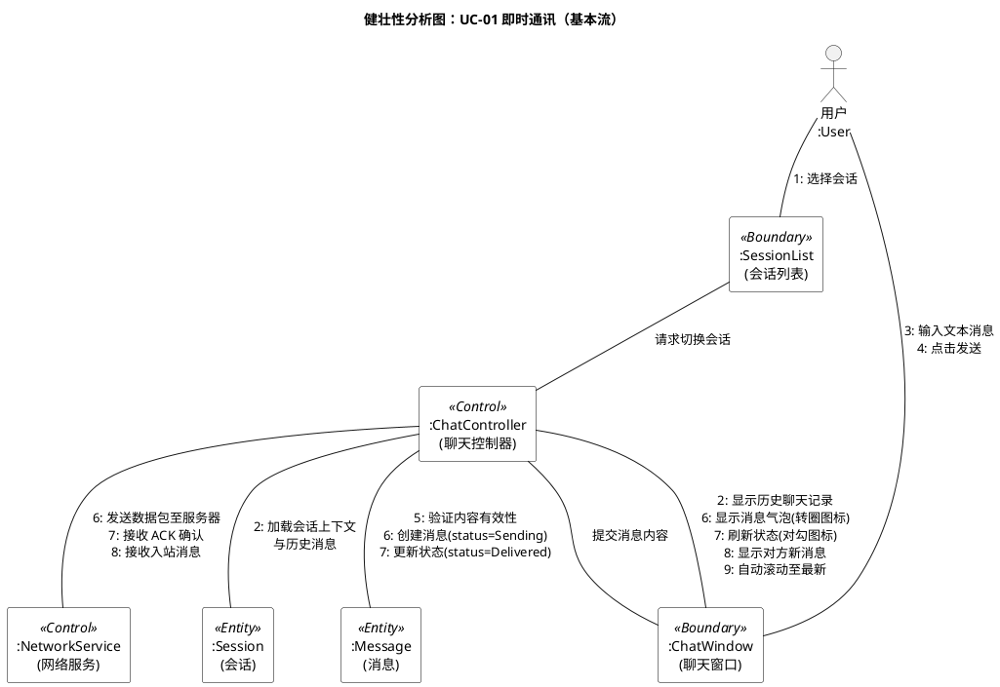

**健壮性分析图说明**：

上图覆盖了 UC-01 基本流的全部 9 个步骤，验证了以下关键点：

1. **职责分离**：用户仅与 SessionList 和 ChatWindow 两个边界对象交互，不直接接触任何控制器或实体——确保了表现层与业务逻辑的隔离。
2. **控制器协调**：ChatController 是核心协调者，连接了所有边界与实体对象。它负责消息验证（步骤 5）、实体创建与状态管理（步骤 6-7）、以及 UI 反馈（步骤 2/6/7/8/9）。
3. **网络抽象**：NetworkService 作为独立的控制对象，将底层通信细节（WebSocket 发送/接收）封装在 ChatController 之后，符合端口与适配器模式的初步设计思路。
4. **BCE 规则合规**：图中不存在 Actor↔Control、Actor↔Entity、Boundary↔Entity 的直接连线，完全遵循健壮性分析的交互规则。

根据 UML 2.2 第9章，通信图强调对象之间的链接关系。这对于发现类图中的"关联"至关重要。
我们选取 UC-01 的基本流（发送消息）进行建模。

### 4.2.1 发送消息通信图

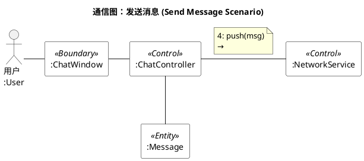

### 4.2.2 通信图分析与链接识别

通过通信图，我们明确了对象在空间上的结构关系（即"谁认识谁"）：

1. UI 与 控制器：ChatWindow 向 ChatController 发送了消息（2: sendMessage），说明窗口必须持有控制器的引用，以便触发业务逻辑。
2. 控制器 与 实体：ChatController 创建并操作 Message（3: create），说明控制器管理着消息实体的生命周期。
3. 控制器 与 网络：ChatController 调用 NetworkService（4: push），说明业务逻辑层依赖于基础设施层来执行发送任务。

### 4.2.3 从通信图导出分析类图

根据通信图中识别出的链接 (Links) 和消息 (Messages)，我们可以直接转化为类图中的关联 (Associations) 和操作 (Operations)。

- **链接 -> 关联**：通信图中两个对象之间有连线，类图中这两个类之间就有关联关系。
- **消息 -> 方法**：对象 A 向 对象 B 发送消息 doSomething()，则 类 B 中必须定义方法 doSomething()

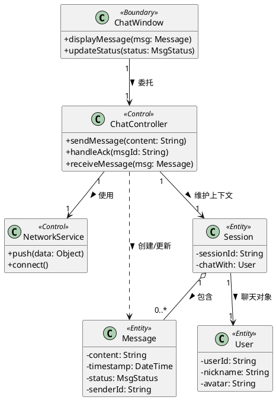

### 4.2.4 类职责说明

- **ChatWindow**: 负责界面的渲染。它不包含业务逻辑，只负责将用户的点击转发给 ChatController。
- **ChatController**: 系统的核心。它隔离了界面和网络，确保界面不知道网络是如何实现的（符合黑盒原则）。它持有 NetworkService 的句柄来发送数据。
- **Message**: 核心业务实体。在分析阶段识别其关键属性（content、status 等），设计阶段将进一步充实其行为方法（如 `markDelivered()`、`markFailed()` 等状态转换逻辑）。

## 4.3 交互建模

### 4.3.1 活动图

**图 4-3 发送消息活动图** - 该图展示了消息从用户输入到最终状态更新的完整业务逻辑流

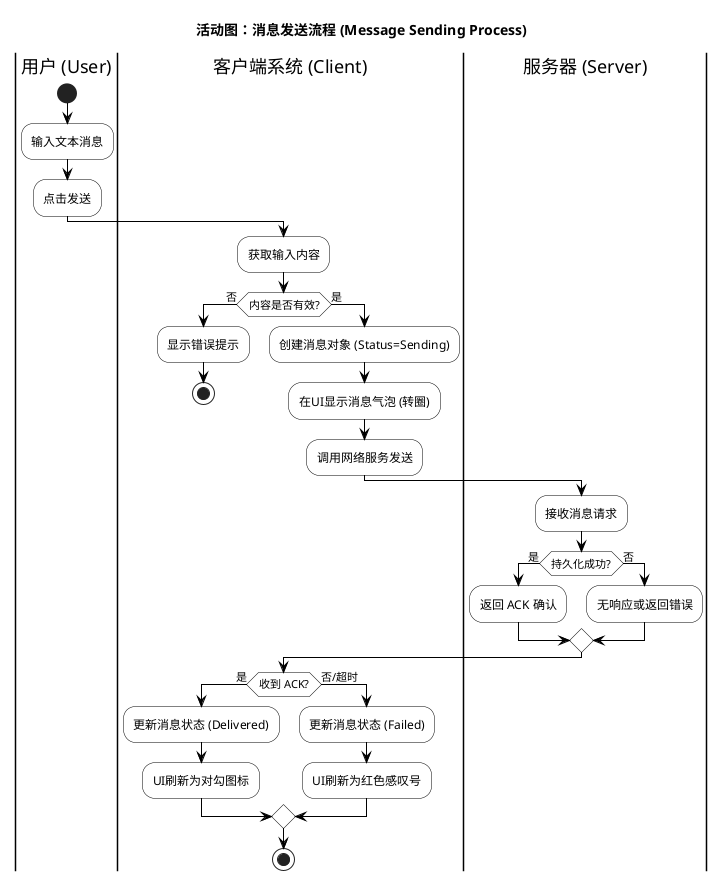

**活动图说明**：

- **泳道 (Swimlanes)**：将活动划分为"用户"、"客户端系统"、"服务器"三个责任区，明确了职责边界。
- **决策节点 (Decision Nodes)**：图中包含两个关键判断：
  1. 前置校验：在发送前拦截非法内容（空消息）。
  2. 后置确认：根据是否收到 ACK 决定消息最终状态，这是保证数据一致性的逻辑核心。

### 4.3.2 顺序图

**图 4-4 消息发送与ACK机制顺序图** - 该图依据 UML 2.2 规范，展示了边界对象、控制对象与实体对象之间的时间序列交互。

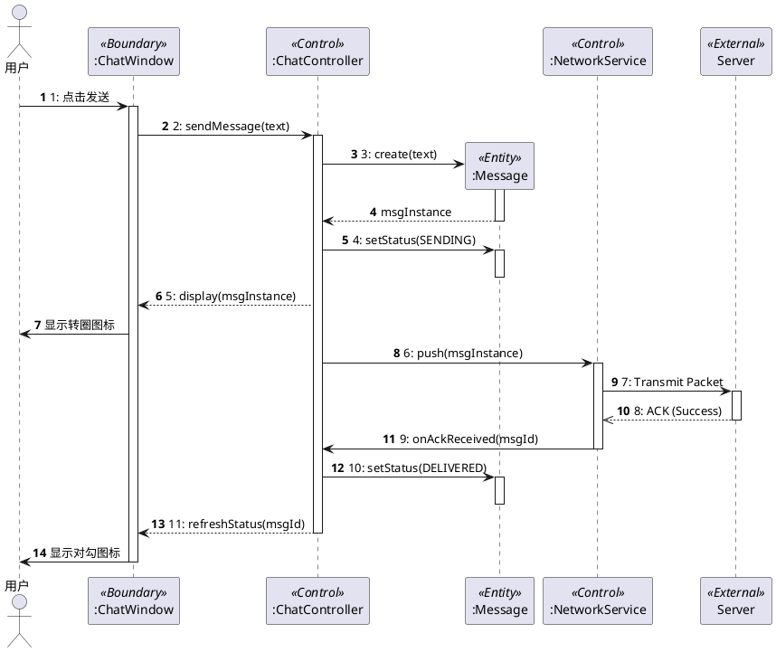

**顺序图说明**：

- **生命线 (Lifelines)**：清晰列出了参与交互的所有对象。
- **激活条 (Activation Bars)**：细长的矩形表示对象处于活动（处理）状态的时间段。
- **消息类型**：
  - 同步消息（实心箭头）：如 sendMessage()，表示调用后等待返回。
  - 异步消息（开箭头）：如 ACK 回执，表示网络层的异步通知。
- **对象创建**：消息 3 (create) 展示了 Message 实体是在发送过程中被动态创建的。

### 4.3.3 状态机图

**图 4-5 消息实体状态机图** - 根据项目"高可靠性"的需求，Message 对象不仅是数据容器，还是一个具有复杂生命周期的状态机。

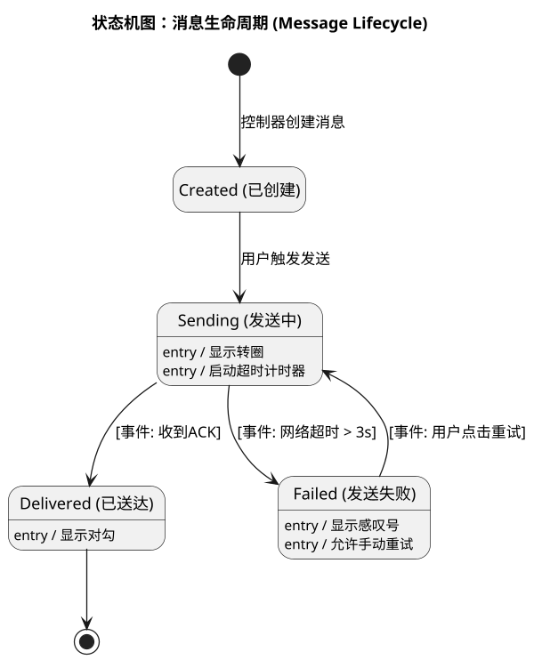

**状态机图说明**：

- **状态 (States)**：
  - Sending：中间瞬态。进入此状态时（entry action）会启动超时计时器。
  - Delivered：最终成功状态。
  - Failed：异常状态。此状态允许转换回 Sending 状态（即重发机制）。
- **转换 (Transitions)**：
  - [事件: 网络超时 > 3s]：这是一个监护条件 (Guard Condition)，定义了从发送中变为失败的触发逻辑。
  - Failed --> Sending：这个闭环路径完美解释了需求中的"重试机制"。

## 4.4 需求分析小结

通过本章的分析工作，我们完成了从外部需求到内部逻辑的映射：

1. 健壮性分析 - 识别了 ChatController 和 Message 等关键类。
2. 通信图 - 确定了这些类之间的静态链接关系。
3. 活动图 - 梳理了业务逻辑的分支判断。
4. 顺序图 - 验证了对象协作的时序正确性。
5. 状态机图 - 确保了核心对象生命周期的完整性。

---

# 第5章 架构设计

## 5.1 架构概述

ShirohaChat 采用经典的**四层面向对象架构**,从上到下依次为:表现层、应用逻辑层、领域层和数据管理层。系统整体采用 C/S(客户端-服务器)架构,客户端与服务端通过 WebSocket 协议进行实时双向通信。

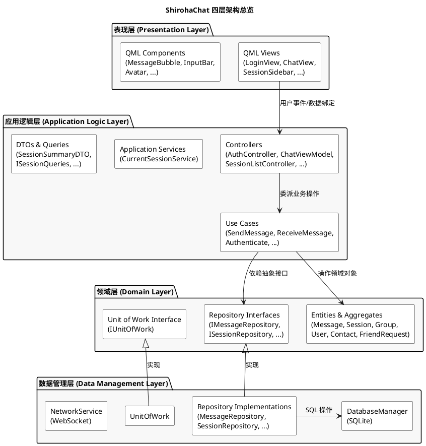

### 架构设计决策说明

1. **依赖方向**: 始终从上层向下层依赖,下层不依赖上层。领域层定义仓库接口,数据管理层提供实现——这是典型的依赖倒置原则(DIP)。
2. **组合根**: 客户端使用 `AppCoordinator` 作为纯 C++ 组合根,在 `main()` 中统一创建所有基础设施、用例和控制器实例,并完成依赖注入。`AppCoordinator` 本身不暴露给 QML。
3. **控制器作为用况控制器**: 每个 Controller 对应一组相关的用况,是 QML 视图与业务逻辑之间的中介。Controllers 使用 `QML_SINGLETON` 宏注册为 QML 单例,由 QML 引擎直接访问。

---

## 5.2 客户端架构

### 5.2.1 表现层

表现层完全由 QML 实现,职责是用户界面渲染与用户交互捕获。表现层不包含任何业务逻辑,所有用户操作都通过属性绑定和方法调用委托给应用逻辑层的 Controller。

| 视图组件 | 文件 | 职责 | 绑定的 Controller |
|---------|------|------|------------------|
| LoginView | `UI/Views/LoginView.qml` | 登录/注册界面 | AuthController |
| SessionSidebar | `UI/Views/SessionSidebar.qml` | 会话列表展示 | SessionListController, AuthController |
| ChatView | `UI/Views/ChatView.qml` | 聊天消息展示与发送 | ChatViewModel |
| GroupInfoView | `UI/Views/GroupInfoView.qml` | 群组信息与成员管理 | GroupController |
| AddFriendDialog | `UI/Views/AddFriendDialog.qml` | 添加好友弹窗 | ContactController |
| FriendRequestsDialog | `UI/Views/FriendRequestsDialog.qml` | 好友请求处理 | ContactController |
| CreateGroupDialog | `UI/Views/CreateGroupDialog.qml` | 创建群组弹窗 | GroupController |

可复用 UI 组件:

| 组件 | 职责 |
|------|------|
| MessageBubble | 单条消息气泡渲染(文本、时间、发送状态图标) |
| InputBar | 多行文本输入框,捕获 Enter 键提交 |
| Avatar | 用户/群组头像展示 |
| AppToast | 非阻塞式全局消息提示 |
| ConnectionStatusBar | WebSocket 连接状态实时反馈条 |

### 5.2.2 应用逻辑层

应用逻辑层由 **Controllers**(用况控制器)和 **Use Cases**(用例对象)组成,是系统行为逻辑的核心所在。

**Controllers**: 面向表现层的适配器,持有 `QML_SINGLETON` 标记,将 QML 的用户事件转化为 UseCase 调用,并将结果通过 Qt 属性通知机制反馈给 UI。

| Controller | 关联的 Use Cases | 职责概述 |
|-----------|-----------------|---------|
| AuthController | AuthenticateUseCase | 登录/注册/登出的 UI 协调 |
| ChatViewModel | SendMessageUseCase, ReceiveMessageUseCase | 当前聊天窗口的消息展示与发送 |
| SessionListController | SwitchSessionUseCase, SessionSyncUseCase | 会话列表维护与切换 |
| ContactController | FriendRequestUseCase | 好友关系管理 |
| GroupController | GroupManagementUseCase | 群组创建与成员管理 |

**Use Cases**: 封装单一业务流程的完整逻辑。每个 UseCase 依赖领域层的仓库接口和实体,不直接依赖具体存储实现。

| Use Case | 业务职责 |
|----------|---------|
| AuthenticateUseCase | 打开本地数据库、连接服务器、Token 认证、保存认证状态 |
| SendMessageUseCase | 本地入库、ACK 计时、网络发送、超时重试、ACK 回执处理 |
| ReceiveMessageUseCase | 入站消息持久化、Session 聚合更新、未读计数递增 |
| SessionSyncUseCase | 本地会话与服务端群列表的一致化同步 |
| SwitchSessionUseCase | 会话切换、私聊会话按需创建、标记已读 |
| FriendRequestUseCase | 发送/接受/拒绝好友请求、好友列表加载 |
| GroupManagementUseCase | 创建群组、增删成员、退群、群成员查询 |

**Application Services**: 跨用例的共享状态管理。`CurrentSessionService` 维护当前用户正在查看的活跃会话 ID,多个 Controller 和 UseCase 共享此状态。

### 5.2.3 领域层

领域层是系统的业务知识核心,包含所有实体类、值对象、聚合根以及仓库接口定义。领域层不依赖任何框架或基础设施代码(仅使用 Qt 的基础类型如 `QString`、`QDateTime`)。

**实体与聚合**:

| 实体/聚合 | 文件 | 职责 | 关键行为方法 |
|-----------|------|------|------------|
| Message | `shared/domain/message.h` | 单条消息,维护状态机(Sending→Delivered/Failed) | `markDelivered()`, `markFailed()`, `isValid()` |
| Session | `shared/domain/session.h` | 会话聚合根,拥有最新消息摘要与未读计数 | `processIncomingMessage()`, `markRead()`, `updateMetadata()` |
| Group | `shared/domain/group.h` | 群组聚合根,管理成员集合并强制执行不变式 | `addMember()`, `removeMember()`, `leave()`, `canAddMember()` |
| GroupMember | `shared/domain/group.h` | 群组成员值对象(userId + role + joinedAt) | — |
| User | `shared/domain/user.h` | 用户实体,包含昵称验证逻辑 | `changeNickname()`, `isValid()` |
| Contact | `shared/domain/contact.h` | 联系人关系实体,维护状态机(Pending→Friend/Blocked) | `acceptRequest()`, `block()`, `unblock()` |
| FriendRequest | `shared/domain/friend_request.h` | 好友请求实体,包含参与者授权校验 | `accept()`, `reject()`, `cancel()` |

**仓库接口(Repository Interfaces)**:

领域层定义了一组纯虚接口,由数据管理层实现:

| 接口 | 职责 |
|------|------|
| IMessageRepository | 消息的增删改查,待确认消息管理 |
| ISessionRepository | 会话聚合的加载与保存 |
| IGroupRepository | 群组聚合的持久化 |
| IUserRepository | 用户信息存取 |
| IContactRepository | 联系人关系存取 |
| IFriendRequestRepository | 好友请求存取 |
| IAuthStateRepository | 认证状态(Token、当前用户 ID)存取 |
| IUnitOfWork | 事务边界管理(回调返回 true 提交,false 回滚) |

### 5.2.4 数据管理层

数据管理层负责领域对象的持久化和外部通信。

**SQLite 存储**: `DatabaseManager` 管理本地 SQLite 数据库的生命周期(打开、Schema 迁移、关闭)。6 个 Repository 实现类将领域实体与 SQL 操作进行映射:

| 仓库实现 | 实现的接口 | 存储介质 |
|---------|-----------|---------|
| MessageRepository | IMessageRepository | SQLite (messages 表) |
| SessionRepository | ISessionRepository | SQLite (sessions 表) |
| GroupRepository | IGroupRepository | SQLite (groups + group_members 表) |
| UserRepository | IUserRepository | SQLite (users 表) |
| FriendRepository | IContactRepository + IFriendRequestRepository | SQLite (contacts + friend_requests 表) |
| AuthStateRepository | IAuthStateRepository | SQLite (auth_state 表) |

**UnitOfWork**: 实现 `IUnitOfWork` 接口,通过 `DatabaseManager::runInTransaction()` 提供事务边界保证。在涉及多表操作的场景(如接收消息需同时更新消息表和会话表)保证原子性。

**NetworkService**: 实现 `INetworkGateway` 端口接口,封装 WebSocket 连接的建立、数据包发送与接收、心跳维护、断线重连等底层通信逻辑。

---

## 5.3 服务端架构

服务端同样遵循四层架构,但由于没有图形界面,其"表现层"体现为 WebSocket 接口层。

### 5.3.1 线程模型

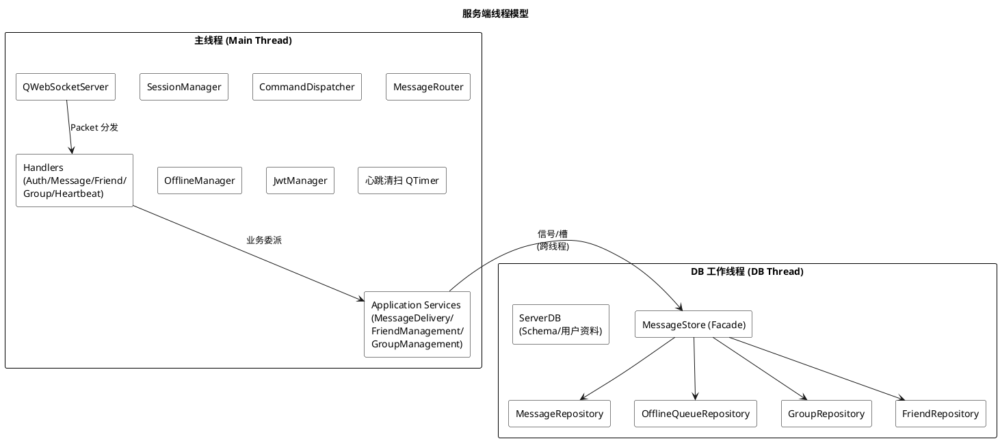

**关键设计**:
- 主线程负责所有 WebSocket I/O 和业务调度,保证 QWebSocket 操作的线程安全
- DB 工作线程持有 `ServerDB` 和 `MessageStore`(门面模式),通过 Qt 信号/槽的 `QueuedConnection` 与主线程异步通信
- `MessageStore` 封装了 4 个具体仓库,对主线程暴露统一的存储接口

### 5.3.2 请求处理流水线

```
WebSocket 入站
    → ClientSession::onTextMessageReceived()
    → PacketCodec::decode()
    → ServerApp::onPacketReceived()
    → CommandDispatcher::dispatch(connectionId, packet)
    → ICommandHandler::handle(connectionId, packet)
    → Application Service (业务处理)
    → MessageStore / Repository (持久化)
    → Service 回调
    → Handler 构造 ACK/Notify
    → ClientSession::sendPacket()
    → WebSocket 出站
```

### 5.3.3 消息投递机制

**私聊消息流**:
1. 发送方客户端发送 `SendMessage` 包
2. `MessageHandler` 校验参数后交给 `MessageDeliveryService`
3. 幂等性检查(防止客户端重试导致重复处理)
4. 立即向发送方返回 `SendMessageAck`
5. 消息持久化到 `MessageRepository`
6. 构造 `ReceiveMessage` 包,通过 `OfflineManager → MessageRouter` 投递
7. 若接收方在线:直接推送;若离线:存入 `OfflineQueueRepository`
8. 接收方上线后触发 `deliverOnLogin()` 离线补发

**群聊消息流**:
1. `MessageDeliveryService` 异步加载群成员列表
2. 验证发送者是否为群成员
3. 向发送者以外的所有成员做 fan-out 投递
4. 每个成员走相同的在线/离线投递逻辑

---

## 5.4 通信协议设计

### 5.4.1 协议概述

客户端与服务端之间使用基于 WebSocket 的自定义 JSON 协议通信。每个数据包(`Packet`)包含以下固定字段:

| 字段 | 类型 | 说明 |
|------|------|------|
| cmd | string | 指令类型(如 "send_message", "connect_ack") |
| msgId | string | 消息唯一标识(UUID) |
| protocolVersion | string | 协议版本号(当前 "1.0") |
| timestamp | string | ISO 8601 UTC 时间戳 |
| payload | object | 业务负载(各指令自定义) |
| code | int | 响应状态码(仅 ACK 包,200=成功) |
| message | string | 描述信息(仅 ACK 包) |

### 5.4.2 指令清单

系统支持 30 种指令,覆盖 5 个业务域:

| 业务域 | 请求指令 | ACK/通知指令 |
|--------|---------|-------------|
| 连接认证 | Connect | ConnectAck |
| 消息通信 | SendMessage | SendMessageAck, ReceiveMessage, MessageReceivedAck |
| 群组管理 | CreateGroup, AddMember, RemoveMember, LeaveGroup, GroupList | CreateGroupAck, AddMemberAck, RemoveMemberAck, LeaveGroupAck, GroupMemberChanged, GroupListAck |
| 好友关系 | FriendRequest, FriendAccept, FriendReject, FriendList, FriendRequestList | FriendRequestAck, FriendAcceptAck, FriendRejectAck, FriendListAck, FriendRequestListAck, FriendRequestNotify, FriendChanged |
| 心跳保活 | Heartbeat | HeartbeatAck |

---

# 第6章 详细设计

## 6.1 设计类图

基于第 4 章的分析类图和第 5 章的架构设计,将分析阶段的类细化为可实现的设计类。以下是第一次迭代(即时通讯核心流)涉及的关键设计类。

### 6.1.1 客户端核心类图

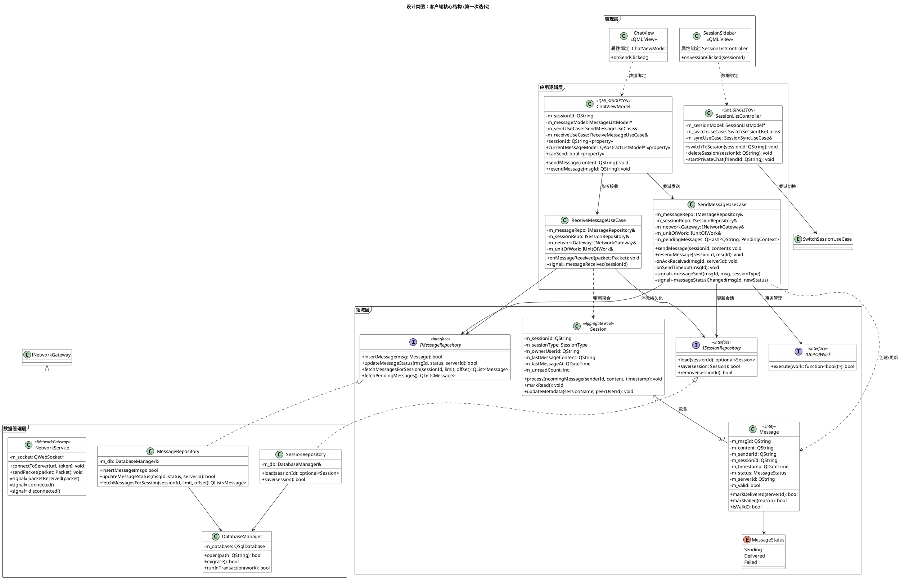

### 6.1.2 服务端核心类图

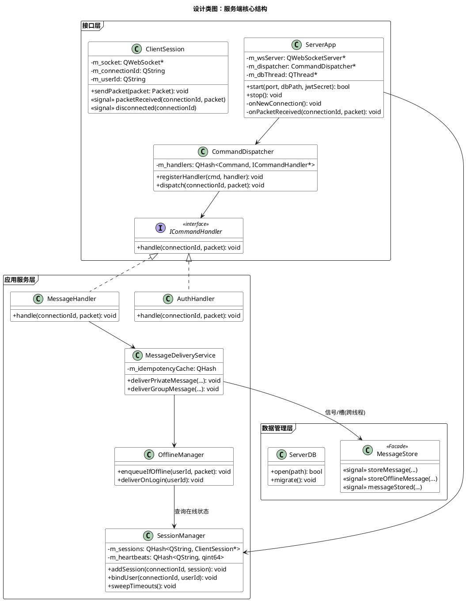

## 6.2 设计模式应用

本系统在实现过程中有意识地应用了多种面向对象设计模式,以下是主要模式的映射:

| 设计模式 | 应用位置 | 设计意图 |
|---------|---------|---------|
| **仓库模式 (Repository)** | `IMessageRepository` / `MessageRepository` 等 | 将领域层与数据访问细节解耦,领域层只依赖接口 |
| **工作单元 (Unit of Work)** | `IUnitOfWork` / `UnitOfWork` | 保证跨表操作的事务原子性,如接收消息时同时更新消息表和会话表 |
| **命令模式 (Command)** | `Command` 枚举 + `CommandDispatcher` + `ICommandHandler` | 服务端根据指令类型查表路由到对应处理器,实现开闭原则 |
| **观察者模式 (Observer)** | Qt signals/slots 贯穿全系统 | 网络层到用例层、用例层到控制器、控制器到视图的事件通知 |
| **单例模式 (Singleton)** | `AppCoordinator::instance()`、各 Controller 的 `QML_SINGLETON` | 保证全局唯一实例,QML 引擎可直接访问 |
| **组合根 (Composition Root)** | 客户端 `AppCoordinator`、服务端 `ServerApp` | 集中管理所有对象的创建和依赖注入 |
| **门面模式 (Facade)** | 服务端 `MessageStore` | 向主线程屏蔽 DB 线程内部的 4 个仓库,提供统一的跨线程存储接口 |
| **MVVM** | QML Views + `ChatViewModel` / `SessionListModel` / `MessageListModel` | 视图通过属性绑定自动刷新,视图模型不持有视图引用 |
| **端口与适配器 (Port & Adapter)** | `INetworkGateway`(端口)/ `NetworkService`(适配器) | 应用逻辑层定义通信抽象,数据管理层提供 WebSocket 实现 |

## 6.3 数据库设计

客户端和服务端各自维护独立的 SQLite 数据库,Schema 通过 `migrate()` 方法自动创建。

### 6.3.1 客户端数据库表

| 表名 | 说明 | 主要字段 |
|------|------|---------|
| auth_state | 认证状态(单行) | token, userId, nickname, serverUrl |
| users | 用户信息缓存 | userId(PK), nickname, lastSeenAt |
| sessions | 会话列表 | sessionId(PK), sessionType, ownerUserId, sessionName, peerUserId, lastMessageContent, lastMessageAt, unreadCount |
| messages | 消息记录 | msgId(PK), content, senderId, sessionId(FK→sessions), timestamp, status, serverId |
| contacts | 联系人关系 | userId+friendUserId(PK), status, createdAt |
| friend_requests | 好友请求 | requestId(PK), fromUserId, toUserId, message, status, createdAt, handledAt |
| groups | 群组信息 | groupId(PK), groupName, creatorUserId, createdAt |
| group_members | 群组成员 | groupId+userId(PK), role, joinedAt |
| pending_acks | 待确认消息(发送中) | msgId(PK) |

### 6.3.2 服务端数据库表

| 表名 | 说明 | 主要字段 |
|------|------|---------|
| users | 注册用户 | userId(PK), nickname, passwordHash, createdAt |
| messages | 消息持久化 | serverId(PK), msgId, senderId, sessionId, sessionType, content, timestamp |
| offline_queue | 离线消息队列 | id(PK), userId, packetJson, enqueuedAt |
| groups | 群组信息 | groupId(PK), groupName, creatorUserId, createdAt |
| group_members | 群组成员 | groupId+userId(PK), role, joinedAt |
| friends | 好友关系 | userId+friendUserId(PK), createdAt |
| friend_requests | 好友请求 | requestId(PK), fromUserId, toUserId, message, status, createdAt |

---

# 后记

ShirohaChat 从需求捕获到系统实现,经历了完整的软件工程开发过程。在这个过程中,我们深刻体会到几点:

一是**用况建模的关键在于始终以用户目标为导向**。开发初期容易犯的错误是将系统功能列表直接等同于用况,导致模型退化为功能分解。在反复推敲后,我们将用况数量从十几个精简为 6 个用户目标级别的用况,每个用况清晰地回答"用户想要达成什么"。

二是**四层架构的分层纪律需要持续维护**。在实际编码过程中,为了开发效率,很容易出现跨层调用的情况(比如控制器直接操作数据库)。我们通过定义领域层的仓库接口、引入依赖注入和组合根模式,在架构层面保证了分层的严格性。

三是**领域对象应该拥有行为**。贫血模型(只有 getter/setter 的纯数据类)是面向对象设计的反模式。在本项目中,`Message` 的状态机转换、`Group` 的成员关系不变式、`FriendRequest` 的参与者授权检查,都体现了"让数据和行为待在一起"的 OOP 核心原则。

最后,这个项目让我们将课程中学习的需求管理、UML 建模、面向对象分析与设计等方法论,在一个真实的 IM 系统中得到了完整的实践。

---

# 参考文献

1. Dean Leffingwell, Don Widrig. *Managing Software Requirements: A Use Case Approach (Second Edition)*. Addison-Wesley, 2003.
2. Daryl Kulak, Eamonn Guiney. *Use Cases: Requirements in Context (Second Edition)*. Addison-Wesley, 2004.
3. Michael Blaha, James Rumbaugh. *Object-Oriented Modeling and Design with UML (Second Edition)*. Pearson, 2005.
4. Simon Bennett, Steve McRobb, Ray Farmer. *Object-Oriented Systems Analysis and Design Using UML (Fourth Edition)*. McGraw-Hill, 2010.
5. Qt Group. *Qt 6.5 Documentation*. https://doc.qt.io/qt-6/
6. Martin Fowler. *Patterns of Enterprise Application Architecture*. Addison-Wesley, 2002.
7. Eric Evans. *Domain-Driven Design: Tackling Complexity in the Heart of Software*. Addison-Wesley, 2003.
